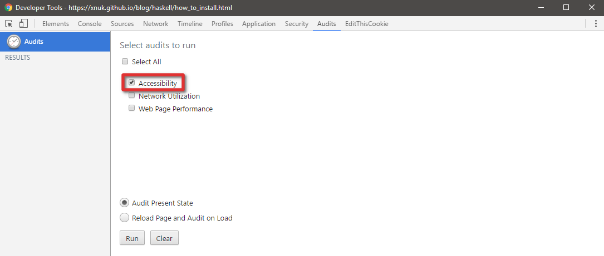
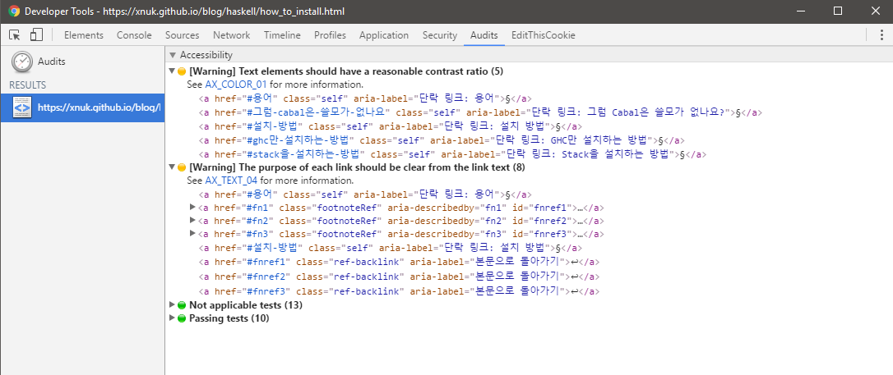
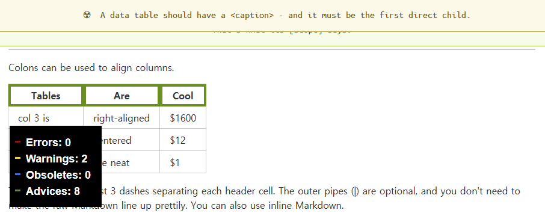

여러분의 웹페이지는 눈과 귀가 완벽히 멀쩡한 사람만 들어오는 게 아닙니다. 특정 색을 보지 못하는 사람도 들어오고, 큰 글씨가 아니면 보이지 않는 사람도 들어오고, 아무것도 보이지 않는 사람도 들어오고, 아무것도 들리지 않는 사람도 들어옵니다. 그리고 설마 그런 사람들이 내 웹페이지에 오겠어 하면서 그런 사람들을 고려하지 않은 여러분의 웹페이지를 들렀다가 상욕을 하며 나갑니다. 너무 익숙해서 욕할 기운도 안 날 수도 있겠지만요.

웹 접근성(Web Accessibility, 힙하게 줄여서 a11y)은 장애를 가지든 안 가지든 인터넷을 자유롭게 쓸 수 있어야 한다에서 나온 개념입니다. 눈과 귀뿐만이 아니라 근육에 문제가 생겨 제한된 동작만으로 컴퓨터를 이용할 수 있는 사람, 특정한 시각적 자극(깜빡인다거나 반복적인 동작이 빠르게 일어난다거나)을 받으면 발작을 일으키는 사람, 논리 능력에 장애가 있는 사람 등도 고려를 해야 합니다.

이걸 전부 고려하려면 골치 아픈 일인 것처럼 보입니다. 공교롭게도, 이에 대한 [W3C 웹 접근성 스탠다드](https://www.w3.org/standards/webdesign/accessibility)는 있습니다. [W3C의 웹 접근성 소개 페이지](https://www.w3.org/standards/webdesign/accessibility)에서 영업도 하고 있습니다. 없을 거 같으셨겠지만 [K-접근성 스탠다드 (KWCAG)](http://www.wah.or.kr/Participation/guide.asp) 역시 있습니다.

서론은 여기까지만 하고, 이하의 내용은 이 블로그에 웹 접근성을 고려하면서 얻은 내용들을 끄적입니다. 추후에 계속 업데이트될 수 있습니다.

## 웹 접근성 검사

### Accessibility Developer Tools

웹 접근성을 고려하는 데에 가장 먼저 접하기 좋은 것은 Chrome에서 작동하는 [Accessibility Developer Tools](https://chrome.google.com/webstore/detail/accessibility-developer-t/fpkknkljclfencbdbgkenhalefipecmb)입니다. 쓰는 방법은 어렵지 않습니다.

1. 웹 접근성을 검사할 사이트에 들어가서 개발자 도구를 엽니다.

2. Audits 탭으로 들어가서 Accessibility 탭을 체크하고 Run 버튼을 누릅니다.

    

3. 웹 접근성을 얼마나 어겼는지 직접 보고 희열을 느낍니다.

    

### a11y.css
[a11y.css](https://ffoodd.github.io/a11y.css/)라는, CSS로 웹 접근성을 검사하는 것도 있습니다. 이 사이트에서 제공하는 링크를 북마크에 담고, 원하는 페이지에서 해당 북마크를 실행시키고 테두리가 칠해져 있는 곳에 마우스를 가져다 놓으시면서 보시면 됩니다.




## 웹 접근성 팁

### 이미지 설명 꼭 달기

`` 태그에는 꼭 `alt` 속성으로 이미지 설명을 달아주셔야 합니다. 이미지 서버가 내려갔다 하는 등의 이유로 이미지를 더 이상 볼 수 없을 경우에 쓰일 대체 텍스트를 상상하시고 쓰시면 좋습니다.

### 어디로 가는지 충분히 설명될 만한 링크 텍스트 달기

[이곳](#)에서 확인하라거나 [여기](#)로 가라거나 식의 성의 없게 설명하는 건 당연 안 되고, [리](#1)[그](#2)[베](#3)[다](#4) [위](#5)[키](#6)식으로 한 단어나 구를 쪼개어 여러 링크를 나열하는 것도 역시 안 됩니다. 차라리 리스트나 각주로 링크를 나열하는 편이 좋습니다. 모든 문장을 없애고 링크 텍스트 하나만도 봐도 이 링크가 어디로 가는지 알 수 있을 정도로 서술해주세요. 부득이하게 숫자나 기호만 써야 할 경우에는 [aria-label 속성](https://developer.mozilla.org/en-US/docs/Web/Accessibility/ARIA/ARIA_Techniques/Using_the_aria-label_attribute)을 사용해주세요.

### 동작은 `<button>`, 이동은 `<a>`
은근히 많이 어기는 사항입니다.

``` html
<button onclick="location.href='https://encrypted.google.com'">구글</button>
```
같은 건 당연히 안 되고, 이 경우 `<a>`를 쓰셔야 합니다. 또한 `<div>`를 `<a>`에 감싸서 커스텀 버튼을 만들지 마시고 그냥 `<button>`을 쓰세요^[[Just use button - A11ycasts - Google Chrome Developers](https://www.youtube.com/watch?v=CZGqnp06DnI)].

단순히 다른 웹페이지나 페이지 내 특정 위치로 이동하는 거라면 `<a>`, 페이지 이동 없이 동작이 이루어지거나 사용자의 입력을 받아 다른 페이지로 넘기는 거라면 `<button>`을 사용하세요.

### 스크린리더 사용자는 표를 싫어해요

표는 시각적으로 깔끔하고 명료하게 보여주는 도구일지 몰라도, 스크린리더에겐 그냥 단어들이 여기저기 연관성 없이 흩어져 있는 것에 불과합니다. 표 대신 리스트를 사용할 수 있다면 그쪽을 고려해보세요. 만약 표가 필요하다고 생각되면 [`<th>` 태그에 `scope` 속성](https://developer.mozilla.org/en-US/docs/Web/HTML/Element/th#attr-scope)을 꼭 써주세요.

### 색 대비는 확실하게

저시력자나 색맹/색약의 경우 글자색과 배경색의 대비가 뚜렷하지 않으면 글씨를 못 읽는 경우가 있을 수 있습니다. [W3C WCAG 2.0의 1.4.3과 1.4.6의 Contrast 항목](https://www.w3.org/TR/2008/REC-WCAG20-20081211/#visual-audio-contrast-contrast)에 따르면, 본문 텍스트 명암비는 최소 4.5:1이어야 하고 큰 텍스트의 경우는 최소 3:1이어야 합니다(Level AA). 또한 본문 텍스트 최소 7:1, 큰 텍스트 최소 4.5:1의 명암비를 권장하고 있습니다(Level AAA). 명암비는 밝은 색과 어두운 색 각각의 상대 휘도에 0.05를 더한 후 비율을 계산한 값입니다. [sRGB의 상대 휘도 구하는 공식은 WCAG 2.0에 나와 있습니다](https://www.w3.org/TR/2008/REC-WCAG20-20081211/#relativeluminancedef)만 물론 매번 손으로 계산하기 귀찮으니 [명암비 계산해주는 사이트](http://leaverou.github.io/contrast-ratio/) 역시 있습니다. 수치를 최대한 올리도록 해보세요.

### 언어를 명시합시다

`<html lang="ko">`와 같이 현재 사이트가 쓰여진 언어를 명시해주세요. 스크린리더가 TTS 음성을 선택하는 데에 도움을 줄 수 있습니다. 간단합니다.

### 자바스크립트는... 음... 모르겠습니다.

세상 모든 사이트가 자바스크립트 없이도 쾌적한 브라우징을 할 수 있었다면 큰 문제는 없었을 텐데요, 그게 안 되니까 결국 시각장애인도 비-시각장애인이 쓰는 브라우저와 같은 브라우저에 스크린리더나 점자 디스플레이를 달고 삽니다. 그래서 자바스크립트는 더 바르셔도 상관은 없는데요, 대신 CLI 브라우저 쓰시는 분들이 안 좋아하실 수는 있습니다. 저는 자바스크립트 안 써도 문제가 없게 만드려고 노력(만) 하는 중입니다.
